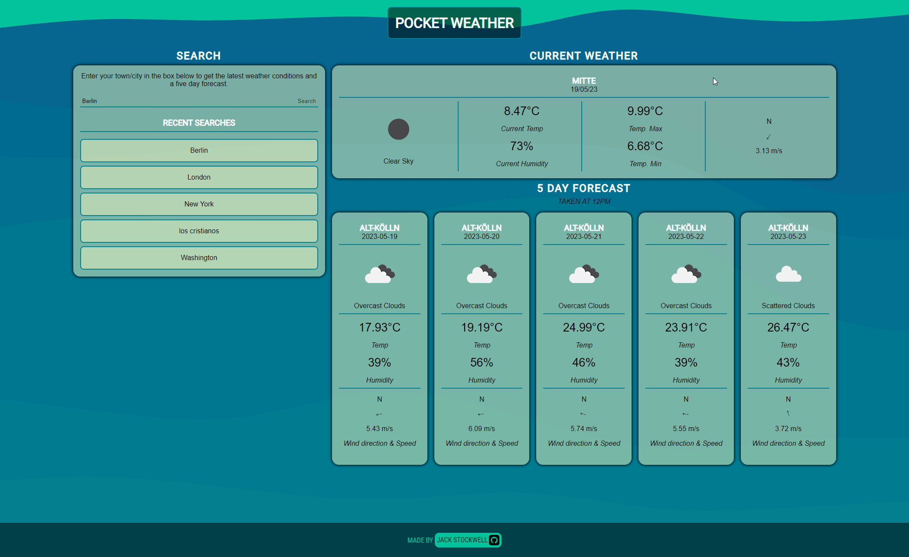

# Pocket Weather!

The Pocket Weather website when given a location will get the current weather observations as well as a forecast for the next 5 Days! This is a global app with 0 fuss. 

The motivation behind this project was to use third-party APIs to process and then display the information that I recieve from them on my webpage by dynamically creating HTML that consists of the data derived from the API. This allows for up to date information to be displayed whenenver the website is called upon.

This project allowed me to continue to build my knowledgeo of working with third-party APIs, and using the data recieved from them. It includes logic to ensure that if the location failed, then the user is informed.

I am particularly proud of the wind arrows, which change depending on the deg that is fed to them using the API. I believe this would make it stand out to other users.

## Screenshots

## Usage

Head to [here](https://jackstockwell.github.io/weatherapp/) to use the weather APP. Start by searching for a location and let the magic happen!

## Credits

[Coolors](https://coolors.co/palette/05668d-028090-00a896-02c39a-f0f3bd) - For the color styles.

[Background images](https://app.haikei.app/) - Generates SVG backgrounds

[forEach](https://developer.mozilla.org/en-US/docs/Web/JavaScript/Reference/Global_Objects/Array/forEach) - Used to add an event listner for the list items.

[Mozilla MDN](https://developer.mozilla.org/en-US/docs/Web) - Used for continued referencing for HTML, CSS and JavaScript.

[Softauthor](https://softauthor.com/create-html-element-in-javascript/) - A how to on HTML Generation with JS

[Open Weather](https://openweathermap.org/api) - The API used to generate the weather and obtain the location.

[Dayjs](https://day.js.org/en/) - Used to get the current day.

[Icon Monster](https://iconmonstr.com/) - Used for the GitHub icon.

## License

N/A

## Future Development

- Would enjoy some more animations, espically on content load.